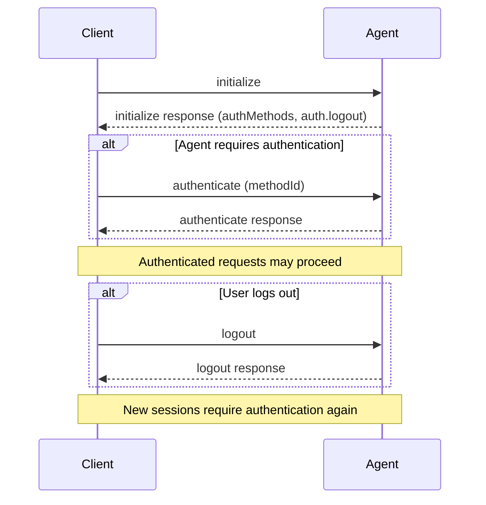

ACP authentication is negotiated during [initialization](/protocol/initialization). Agents advertise available authentication methods in `authMethods`, Clients choose one by calling `authenticate`, and Agents that support ending an authenticated state advertise the draft `logout` capability.

<Note>
  The `logout` method and `agentCapabilities.auth.logout` capability are still
  unstable and may change before they are stabilized.
</Note>

<br />



<br />

## Advertising Authentication

Agents advertise authentication options in the `authMethods` field of the `initialize` response. Each method has an `id` that the Client passes back to the Agent in a later `authenticate` request.

Agents that support `logout` also advertise `agentCapabilities.auth.logout`:

```json highlight={7-11,12-18}
{
  "jsonrpc": "2.0",
  "id": 0,
  "result": {
    "protocolVersion": 1,
    "agentCapabilities": {
      "auth": {
        "logout": {}
      }
    },
    "authMethods": [
      {
        "id": "agent-login",
        "name": "Agent login",
        "description": "Sign in using the agent's login flow"
      }
    ]
  }
}
```

If `agentCapabilities.auth.logout` is omitted or `null`, the Agent does not support `logout` and Clients **MUST NOT** call it. Supplying `{}` means the Agent supports the method.

### Authentication method types

The default authentication method type is `agent`, where the Agent handles authentication itself. When no `type` is present, the method is treated as `agent`:

```json
{
  "id": "agent-login",
  "name": "Agent login",
  "description": "Sign in using the agent's login flow"
}
```

Draft authentication method types provide additional information so Clients can offer better UI:

- `env_var`: the user provides credentials that the Client passes to the Agent as environment variables.
- `terminal`: the Client runs the Agent's terminal authentication flow for the user.

`terminal` methods require Client support. Clients advertise this during initialization with `clientCapabilities.auth.terminal`:

```json highlight={7-9}
{
  "jsonrpc": "2.0",
  "id": 0,
  "method": "initialize",
  "params": {
    "protocolVersion": 1,
    "clientCapabilities": {
      "auth": {
        "terminal": true
      }
    }
  }
}
```

See the [draft schema](/protocol/draft/schema#authmethod) for the full `AuthMethod` definitions.

## Authenticating

When an Agent requires authentication before allowing session creation, the Client calls `authenticate` with one of the advertised authentication method IDs:

```json
{
  "jsonrpc": "2.0",
  "id": 1,
  "method": "authenticate",
  "params": {
    "methodId": "agent-login"
  }
}
```

<ParamField path="methodId" type="string" required>
  The ID of the authentication method to use. This value must match one of the
  methods advertised in the `initialize` response.
</ParamField>

On success, the Agent returns an empty result:

```json
{
  "jsonrpc": "2.0",
  "id": 1,
  "result": {}
}
```

After successful authentication, the Client can create new sessions without receiving an `auth_required` error for authentication-gated requests.

## Logging Out

The draft `logout` method allows Clients to end the current authenticated state. Clients should only call it after verifying the Agent advertised `agentCapabilities.auth.logout` during initialization.

```json
{
  "jsonrpc": "2.0",
  "id": 2,
  "method": "logout",
  "params": {}
}
```

On success, the Agent returns an empty result:

```json
{
  "jsonrpc": "2.0",
  "id": 2,
  "result": {}
}
```

After a successful `logout`, new sessions that require authentication will require the Client to call `authenticate` again.

## Active Sessions

The protocol does not guarantee what happens to already-running sessions after `logout`. Agents may terminate them, keep them running, or return `auth_required` errors for future session activity.

Clients **SHOULD** be prepared for active session operations to fail with authentication-related errors after logout and should prompt the user to authenticate again when appropriate.
