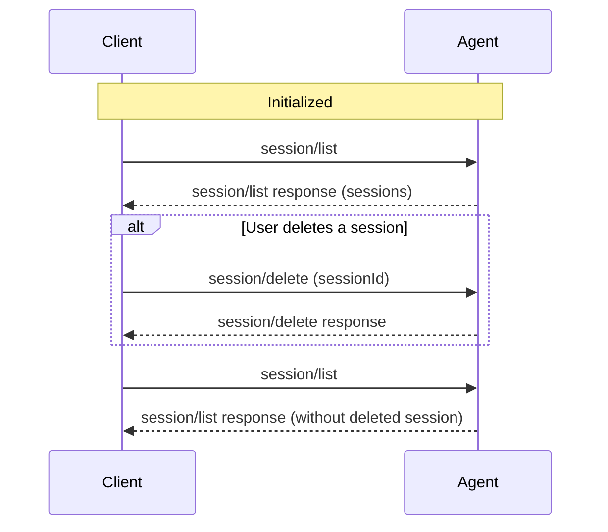

The `session/delete` method allows Clients to remove sessions from an Agent's `session/list` results. This gives users a standard way to manage session history across ACP Clients and Agents.

Before deleting sessions, Clients **MUST** first complete the [initialization](/protocol/initialization) phase and verify the Agent supports this capability.

<br />



<br />

## Checking Support

Before attempting to delete a session, Clients **MUST** verify that the Agent supports this capability by checking the unstable `sessionCapabilities.delete` field in the `initialize` response:

```json highlight={7-9}
{
  "jsonrpc": "2.0",
  "id": 0,
  "result": {
    "protocolVersion": 1,
    "agentCapabilities": {
      "sessionCapabilities": {
        "delete": {}
      }
    }
  }
}
```

If `sessionCapabilities.delete` is omitted or `null`, the Agent does not support deleting sessions and Clients **MUST NOT** attempt to call `session/delete`. Supplying `{}` means the Agent supports the method.

## Deleting a Session

Clients delete a session by calling `session/delete` with the session ID to remove from session history:

```json
{
  "jsonrpc": "2.0",
  "id": 3,
  "method": "session/delete",
  "params": {
    "sessionId": "sess_abc123def456"
  }
}
```

<ParamField path="sessionId" type="SessionId" required>
  Unique identifier for the session to delete.
</ParamField>

On success, the Agent returns an empty result:

```json
{
  "jsonrpc": "2.0",
  "id": 3,
  "result": {}
}
```

## Semantics

- Agents **MUST NOT** accept `session/delete` calls unless they advertised `sessionCapabilities.delete` during initialization.
- Deleted sessions no longer appear in future `session/list` results.
- Deleting an already-deleted session, or a session that never existed, **SHOULD** succeed silently.
- Agents may implement soft delete or hard delete. ACP only specifies the user-facing session-list behavior.
- Behavior for `session/load` on a deleted session is implementation-defined.
- Behavior for deleting an active session is implementation-defined.
