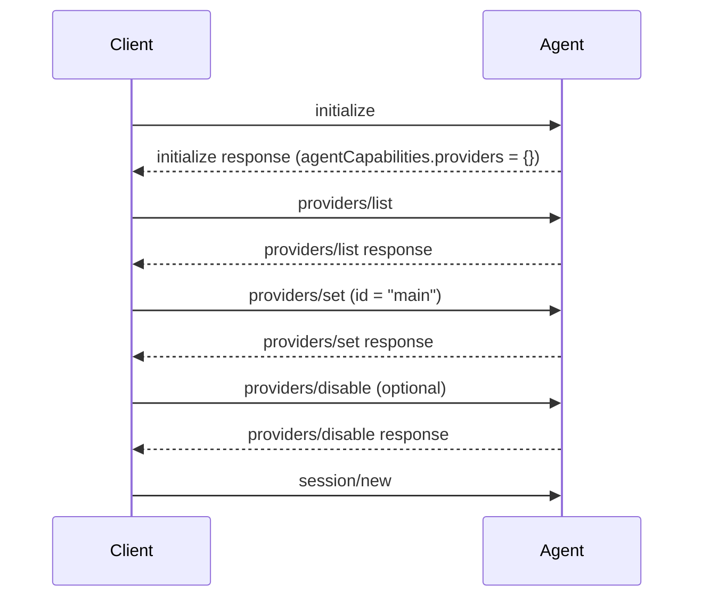

- Author(s): [@anna239](https://github.com/anna239), [@xtmq](https://github.com/xtmq)

## Elevator pitch

> What are you proposing to change?

Add the ability for clients to discover and configure agent LLM providers (identified by `id`) via dedicated provider methods:

- `providers/list`
- `providers/set`
- `providers/disable`

This allows clients to route LLM requests through their own infrastructure (proxies, gateways, or self-hosted models) without agents needing to know about this configuration in advance.

## Status quo

> How do things work today and what problems does this cause? Why would we change things?

ACP does not currently define a standard method for configuring LLM providers.

In practice, provider configuration is usually done via environment variables or agent-specific config files. That creates several problems:

- No standard way for clients to discover what providers an agent exposes
- No standard way to update one specific provider by id
- No standard way to disable a specific provider at runtime while preserving provider discoverability
- Secret-bearing values in headers are difficult to handle safely when configuration must be round-tripped

This particularly affects:

- **Client proxies**: clients want to route agent traffic through their own proxies, for example to add headers or logging
- **Enterprise deployments**: organizations want to route LLM traffic through internal gateways for compliance, logging, and cost controls
- **Self-hosted models**: users running local servers (vLLM, Ollama, etc.) need to redirect agent traffic to local infrastructure
- **API gateways**: organizations using multi-provider routing, rate limiting, and caching need standardized endpoint configuration

## Shiny future

> How will things play out once this feature exists?

Clients will be able to:

1. Understand whether an agent supports client-managed LLM routing
2. See where the agent is currently sending LLM requests (for example in settings UI)
3. Route agent LLM traffic through their own infrastructure (enterprise proxy, gateway, self-hosted stack)
4. Update routing settings from the client instead of relying on agent-specific env vars
5. Disable a provider when needed and later re-enable it explicitly
6. Apply these settings before starting new work in sessions

## Implementation details and plan

> Tell me more about your implementation. What is your detailed implementation plan?

### Intended flow



1. Client initializes and checks `agentCapabilities.providers`.
2. Client calls `providers/list` to discover available providers, their current routing targets (or disabled state), supported protocol types, and whether they are required.
3. Client calls `providers/set` to apply new (required) configuration for a specific provider id.
4. Client may call `providers/disable` when a non-required provider should be disabled.
5. Client creates or loads sessions.

### Capability advertisement

The agent advertises support with an empty object capability:

```typescript
interface AgentCapabilities {
  // ... existing fields ...

  /**
   * Provider configuration support.
   * If present, the agent supports providers/list, providers/set, and providers/disable.
   */
  providers?: {};
}
```

If `providers` is absent, clients must treat provider methods as unsupported.

### Types

```typescript
/**
 * Well-known API protocol identifiers for LLM providers.
 *
 * This is an open string type: agents and clients MUST handle unknown
 * protocol identifiers gracefully.
 *
 * Protocol names beginning with `_` are free for custom use, like other
 * ACP extension methods. Protocol names that do not begin with `_` are
 * reserved for the ACP spec.
 */
type LlmProtocol =
  | "anthropic"
  | "openai"
  | "azure"
  | "vertex"
  | "bedrock"
  | string;

interface ProviderCurrentConfig {
  /** Protocol currently used by this provider. */
  apiType: LlmProtocol;

  /** Base URL currently used by this provider. */
  baseUrl: string;
}

interface ProviderInfo {
  /** Provider identifier, for example "main" or "openai". */
  id: string;

  /** Supported protocol types for this provider. */
  supported: LlmProtocol[];

  /**
   * Whether this provider is mandatory and cannot be disabled via providers/disable.
   * If true, clients must not call providers/disable for this id.
   */
  required: boolean;

  /**
   * Current effective non-secret routing config.
   * Null or omitted means provider is disabled.
   */
  current?: ProviderCurrentConfig | null;

  /** Extension metadata */
  _meta?: Record<string, unknown>;
}
```

### `providers/list`

```typescript
interface ProvidersListRequest {
  /** Extension metadata */
  _meta?: Record<string, unknown>;
}

interface ProvidersListResponse {
  /** Configurable providers with current routing info suitable for UI display. */
  providers: ProviderInfo[];

  /** Extension metadata */
  _meta?: Record<string, unknown>;
}
```

### `providers/set`

`providers/set` updates the full configuration for one provider id.

```typescript
interface SetProviderRequest {
  /** Provider id to configure. */
  id: string;

  /** Protocol type for this provider. */
  apiType: LlmProtocol;

  /** Base URL for requests sent through this provider. */
  baseUrl: string;

  /**
   * Full headers map for this provider.
   * May include authorization, routing, or other integration-specific headers.
   * Omitting this field is equivalent to an empty map (no headers).
   */
  headers?: Record<string, string>;

  /** Extension metadata */
  _meta?: Record<string, unknown>;
}

interface SetProviderResponse {
  /** Extension metadata */
  _meta?: Record<string, unknown>;
}
```

### `providers/disable`

```typescript
interface DisableProviderRequest {
  /** Provider id to disable. */
  id: string;

  /** Extension metadata */
  _meta?: Record<string, unknown>;
}

interface DisableProviderResponse {
  /** Extension metadata */
  _meta?: Record<string, unknown>;
}
```

### Example exchange

**initialize Response:**

```json
{
  "jsonrpc": "2.0",
  "id": 0,
  "result": {
    "protocolVersion": 1,
    "agentInfo": {
      "name": "MyAgent",
      "version": "2.0.0"
    },
    "agentCapabilities": {
      "providers": {},
      "sessionCapabilities": {}
    }
  }
}
```

**providers/list Request:**

```json
{
  "jsonrpc": "2.0",
  "id": 1,
  "method": "providers/list",
  "params": {}
}
```

**providers/list Response:**

```json
{
  "jsonrpc": "2.0",
  "id": 1,
  "result": {
    "providers": [
      {
        "id": "main",
        "supported": ["bedrock", "vertex", "azure", "anthropic"],
        "required": true,
        "current": {
          "apiType": "anthropic",
          "baseUrl": "http://localhost/anthropic"
        }
      },
      {
        "id": "openai",
        "supported": ["openai"],
        "required": false,
        "current": null
      }
    ]
  }
}
```

**providers/set Request:**

```json
{
  "jsonrpc": "2.0",
  "id": 2,
  "method": "providers/set",
  "params": {
    "id": "main",
    "apiType": "anthropic",
    "baseUrl": "https://llm-gateway.corp.example.com/anthropic/v1",
    "headers": {
      "X-Request-Source": "my-ide"
    }
  }
}
```

**providers/set Response:**

```json
{
  "jsonrpc": "2.0",
  "id": 2,
  "result": {}
}
```

**providers/disable Request:**

```json
{
  "jsonrpc": "2.0",
  "id": 3,
  "method": "providers/disable",
  "params": {
    "id": "openai"
  }
}
```

**providers/disable Response:**

```json
{
  "jsonrpc": "2.0",
  "id": 3,
  "result": {}
}
```

### Behavior

1. **Capability discovery**: agents that support provider methods MUST advertise `agentCapabilities.providers: {}` in `initialize`. Clients SHOULD only call `providers/*` when this capability is present.
2. **Timing and session impact**: provider methods MUST be called after `initialize`. Clients SHOULD configure providers before creating or loading sessions. Agents MAY choose not to apply changes to already running sessions, but SHOULD apply them to sessions created or loaded after the change.
3. **List semantics**: `providers/list` returns configurable providers, their supported protocol types, current effective routing, and `required` flag. Providers SHOULD remain discoverable in list after `providers/disable`.
4. **Client behavior for required providers**: clients SHOULD NOT call `providers/disable` for providers where `required: true`.
5. **Disabled state encoding**: in `providers/list`, `current` omitted or `current: null` means the provider is disabled and MUST NOT be used by the agent for LLM calls.
6. **Set semantics and validation**: `providers/set` replaces the full configuration for the target `id` (`apiType`, `baseUrl`, `headers`); an omitted `headers` field is treated as an empty map. If `id` is unknown, `apiType` is unsupported for that provider, or params are malformed, agents SHOULD return `invalid_params`.
7. **Disable semantics**: `providers/disable` disables the target provider at runtime. A disabled provider MUST appear in `providers/list` with `current` omitted or `current: null`. If target provider has `required: true`, agents MUST return `invalid_params`. Disabling an unknown `id` SHOULD be treated as success (idempotent behavior).
8. **Scope and persistence**: provider configuration is process-scoped and SHOULD NOT be persisted to disk.

## Frequently asked questions

> What questions have arisen over the course of authoring this document?

### What does `null` mean in `providers/list`?

`current` omitted or `current: null` means the provider is disabled.

When disabled, the agent MUST NOT route LLM calls through that provider until the client enables it again with `providers/set`.

### Why is there a `required` flag?

Some providers are mandatory for agent operation and must not be disabled.

`required` lets clients hide or disable the provider-disable action in UI and avoid calling `providers/disable` for those ids.

### Why not a single `providers/update` method for full list replacement?

A full-list update means the client must send complete configuration (including `headers`) for all providers every time.

If the client wants to change only one provider, it may not know headers for the others. In that case it cannot safely build a correct full-list payload.

Also, `providers/list` does not return headers, so the client cannot simply "take what the agent returned" and send it back with one edit.

Per-provider methods (`set` and `disable`) avoid this problem and keep updates explicit.

### Why doesn't `providers/list` return headers?

Header values may contain secrets and should not be echoed by the agent. `providers/list` is intentionally limited to non-secret routing information (`current.apiType`, `current.baseUrl`).

### Why are `providers/list` and `providers/set` payloads different?

`providers/set` accepts `headers`, including secrets, and is write-oriented.

`providers/list` is read-oriented and returns only non-secret routing summary (`current`) for UI and capability discovery.

### Why is this separate from `initialize` params?

Clients need capability discovery first, then provider discovery, then configuration. A dedicated method family keeps initialization focused on negotiation and leaves provider mutation to explicit steps.

### Why not use `session-config` with a `provider` category instead?

`session-config` is a possible alternative, and we may revisit it as the spec evolves.

We did not choose it as the primary approach in this proposal because provider routing here needs dedicated semantics that are difficult to express with today's session config model:

- Multiple providers identified by `id`, each with its own lifecycle
- Structured payloads (`apiType`, `baseUrl`, full `headers` map) rather than simple scalar values
- Explicit discoverable (`providers/list`) and disable (`providers/disable`) semantics

Today, `session-config` values are effectively string-oriented and do not define a standard multi-value/structured model for this use case.

## Revision history

- 2026-04-19: Made `ProviderInfo.current` optional in `providers/list`; disabled state may be encoded as omitted `current` or `current: null`
- 2026-03-22: Finalized provider disable semantics - `providers/remove` renamed to `providers/disable`, required providers are non-disableable, and disabled state is represented as `current: null`
- 2026-03-21: Initial draft of provider configuration API (`providers/list`, `providers/set`, `providers/remove`)
- 2026-03-07: Rename "provider" to "protocol" to reflect API compatibility level; make `LlmProtocol` an open string type with well-known values; resolve open questions on identifier standardization and model availability
- 2026-03-04: Revised to use dedicated `setLlmEndpoints` method with capability advertisement
- 2026-02-02: Initial draft - preliminary proposal to start discussion
